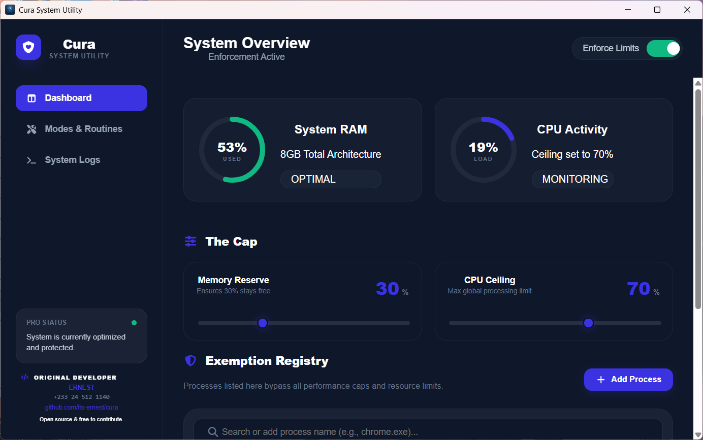

# 🛡️ Cura (as in "curer")

[](https://pkg.go.dev/github.com/its-ernest/cura)
[](https://goreportcard.com/report/github.com/its-ernest/cura)
[](https://github.com/its-ernest/cura/actions/workflows/docs.yml)
[](https://github.com/its-ernest/cura/actions/workflows/go.yml)
[](https://opensource.org/licenses/MIT)

**System Performance Booster & Resource Enforcement for Windows.**

**Cura System Utility** is a lightweight, Go-powered utility designed to protect your system's stability. By monitoring real-time RAM and CPU usage, Cura automatically identifies and terminates background "stale" processes when your custom-defined memory caps are breached.



## Download For Free Now

If you are a user looking to keep your system snappy, you can download the latest production-ready binary here:

<div align="">
  <a href="https://github.com/its-ernest/cura/releases/download/v0.1.9/cura-amd64-installer.exe">
    
  </a>
</div>

<div align="">
  <a href="https://github.com/its-ernest/cura/releases/download/v0.1.9/cura-arm64-installer.exe">
    
  </a>
</div>

* Extract the content of the downloaded file and launch ***cura.exe*** .
* Then **TOGGLE** the ***Enforce Now*** button
* **CURA NOW SUPPORTS x64(amd64) and arm64**
---

## Features

* **The Cap:** Set a hard memory reserve percentage to ensure your OS always has breathing room.
* **Temporal Intelligence:** New in v0.1.3—Cura now checks process age and foreground status before acting.
* **Smart Enforcement:** Targets low-CPU "idle" processes first to avoid interrupting active work.
* **Real-time Telemetry:** High-fidelity dashboard built with React and Wails.
* **System Protection:** Built-in whitelist for critical Windows services and development tools.

## Configuration

Cura uses a `settings.toml` file in the root directory to persist user preferences across sessions.

```toml
[enforcement]
is_enforced = true
memory_cap = 80.0
cpu_ceiling = 70.0

```

## 🤝 Contributing

We welcome contributions from the community! Whether it's fixing bugs, improving the UI, or adding new "Intelligence" logic, your help makes Cura better.

* **Want to help?** Check out our [CONTRIBUTING.md](./CONTRIBUTING.md) for setup instructions.
* **Tech Stack:** Go 1.24+, React, Wails CLI.

## Safety Disclaimer

Cura has the power to terminate processes. While it includes a default protection list for system-critical tasks (including WebView2 and your IDE), use it with caution. Always whitelist your unsaved work-heavy applications.

---

**License:** [MIT](https://www.google.com/search?q=./LICENSE)
* As a condition of this license, any software or redistribution derived from this source code must retain the 'Original Developer' attribution and a link to the original repository github.com/its-ernest/cura in a clearly visible 'About' or 'Credits' section of the user interface